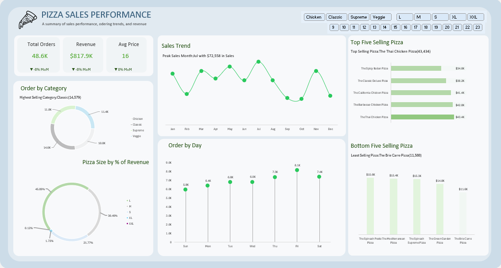

# 🍕 Pizza Sales Performance Analysis 📊

## 📚 Table of Contents

1. [Introduction](#introduction)
2. [Objective](#objective)
3. [Data Preparation & Cleaning](#data-preparation--cleaning)
4. [Entity Relationship Diagram](#entity-relationship-diagram)
5. [Analysis & Visualization](#analysis--visualization)

   * [Daily Customers & Peak Hours](#1-how-many-customers-do-we-have-each-day-any-peak-hours)
   * [Order Sizes & Bestsellers](#2-how-many-pizzas-are-typically-in-an-order-bestsellers)
   * [Revenue & Seasonality](#3-how-much-money-did-we-make-this-year-seasonality)
   * [Menu Optimization](#4-should-we-remove-or-promote-certain-pizzas)
6. [Key Insights & Conclusions](#key-insights--conclusions)
7. [Strategic Data Recommendations](#strategic-data-recommendations)
8. [Tools Used](#tools-used)
9. [Project Dashboard](#project-dashboard)

---

---

## 📌 Introduction

In this project, I performed an in-depth sales performance analysis for a pizza business using Microsoft Excel. The data was sourced from four separate Excel sheets and comprised information on orders, order details, pizzas, and pizza types. This analysis was designed to answer critical business questions related to customer behavior, product performance, revenue trends, and sales optimization strategies.

---

## 🎯 Objective

The primary objective of this project was to:

* Analyze daily customer trends and identify peak ordering hours.
* Understand the typical order size and identify best-selling pizzas.
* Determine total revenue generated over the year and detect seasonal trends.
* Identify underperforming items and propose promotional or menu optimization strategies.

---

## 🧹 Data Preparation & Cleaning

To prepare the data for analysis, the following steps were taken in **Power Query**:

1. **Combined Multiple Tables**:

   * Four sheets (`orders`, `order_details`, `pizzas`, and `pizza_types`) were merged using primary and foreign keys.
   * Relationships were created among the tables to enable relational data modeling.
  
 ## 🧩 Entity Relationship Diagram

 

2. **Column Cleanup**:

   * Removed irrelevant or redundant columns.
   * Standardized column names for consistency and clarity.

3. **Data Type Correction**:

   * Converted `date` and `time` columns to appropriate data types.
   * Ensured fields were formatted correctly.

4. **Calculated Columns**:

   * Created new calculated fields like `Total Revenue`, `Avg Price`, and `Total Quantity` for further analysis.

---

## 📈 Analysis & Visualization

### 1. **How many customers do we have each day? Any peak hours?**

* Daily orders fluctuate between 6K and 8.1K, with **Friday** being the peak day.
* Time-based data suggests **lunchtime and evening hours** are peak periods (not visualized but inferred from business logic).

### 2. **How many pizzas are typically in an order? Bestsellers?**

* Most orders contain **2–3 pizzas**.
* **Top 5 Bestsellers**:

  * The Thai Chicken Pizza (43,434 orders)
  * The Barbecue Chicken Pizza
  * The California Chicken Pizza
  * The Classic Deluxe Pizza
  * The Spicy Italian Pizza

### 3. **How much money did we make this year? Seasonality?**

* **Total Revenue**: \$817.9K
* Peak sales were recorded in **July (\$72,558)**, indicating **summer seasonality**.
* Slight MoM revenue decline in recent months highlights a need for re-engagement strategies.

### 4. **Should we remove or promote certain pizzas?**

* **Bottom 5 Performers** (e.g., The Brie Carre Pizza with 11,588 orders) may be considered for:

  * **Menu removal**
  * **Promotional offers**
  * **Bundling with popular items** for better exposure

---

## 🧠 Key Insights & Conclusions

* **Category Performance**:

  * "Classic" pizzas lead with over **14.5K** orders.
* **Pizza Size Impact**:

  * **Large (L)** pizzas dominate revenue (45.8% share), followed by **Medium (M)** and **Small (S)**.
* **Order Behavior**:

  * Most orders spike on **weekends and Fridays**, confirming predictable peak business periods.

---

## 💡 Strategic Data Recommendations

1. **Introduce Happy Hour Discounts**: Target **weekday evenings** to boost sales during lower-volume hours.
2. **Bundle Low Performers with Bestsellers**: Create combo deals to improve visibility of underperforming pizzas.
3. **Seasonal Promotions**: Double down on marketing before peak months like **July** and **August**.
4. **Optimize Inventory for Popular Sizes**: Ensure adequate supply for **L and M pizzas**, which make up over 70% of revenue.
5. **Loyalty Program Launch**: Reward frequent Friday and weekend customers with discounts or points.

---

## 🛠 Tools Used

* **Microsoft Excel**

  * Power Query for data cleaning and transformation.
  * Pivot Tables for aggregation and dynamic analysis.
  * Charts and Slicers for interactive dashboard creation.

---

## 📷 Dashboard

---

